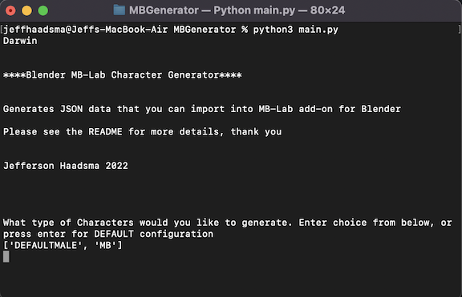
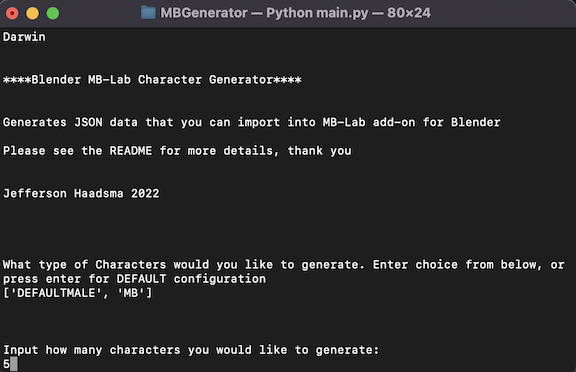
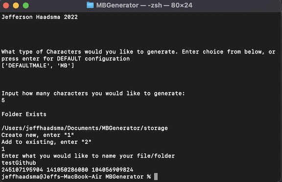
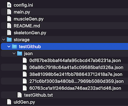
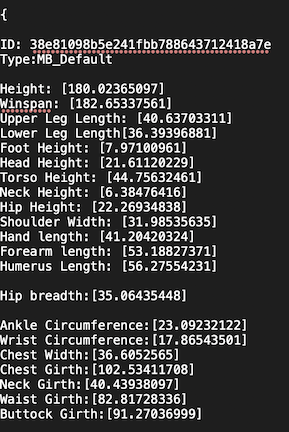
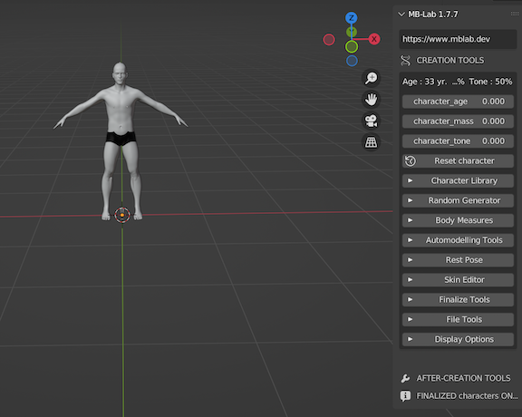
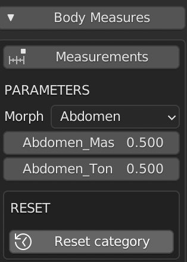
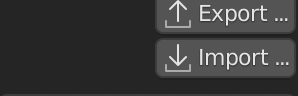
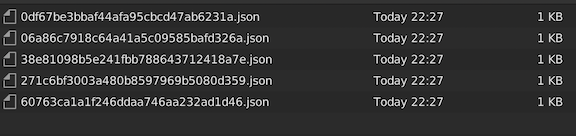
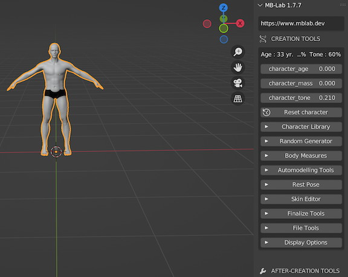

**OVERVIEW:**

This is a python program that generates and outputs JSON data formatted to be imported into Blender 3D modeling software and in conjuction with the Blender add-on MB-Lab to generate randomized but proportionally realistic 3d character models. 

Blender: [https://www.blender.org/](https://www.blender.org/)

MBlab: [https://mblab.dev/](https://mblab.dev/)

While MB-Lab has an existing randomize character function, it is based on weighted values which does not produce results that one would find in the variance of human body proportions in the natural world. This programs randomization is based on bell-curve distrubution, which results in a more accurate representation of realistic randomized human proportions.

This program also can generate multiple character model JSON data sets at one time, while the built-in MBlab randomizer can only do one at a time. The program will autimatically create a storage directory within the programs root directory if one is not present, and then store the JSON data and corresponding text file formatted in a easy to read way for each character model.

This is not yet completed, namely the girth of some of the limb portions do not have a generated random value and will default to the default MBLab character model value, resulting in some character models looking out of proportion in terms of limb and trunk girth. It is planned on basing these values off of a randomized muscle mass calculation which is still in progress in the muscleGen.py python file. 

This was coded and tested on an Apple silicon chipped Mac running on macOs 12.3.1 and python 3.8.9. I cannot guarentee that this will run correctly on other systems.

**How to run:**

1. Download the program and run main.py:

`python3 main.py`

2. Select config. Currently, only the default configuration is set up correctly, so simply press enter:                  

3. Input how many characters you would like to generate:       

4. Choose to create a new directory to store the character data in, or add to an existing directory in the 'storage' subfolder.

5. This is what is generated. The text file contains a readable output of each individual character models data, and the json folder contains the JSON data that you can import into the MBLab Blender add-on: 

Text file output format:

6. Open up Blender with the MBlab add-on installed

7. Generate a MBLab default character using the 'CaucasianMale' setting

8. Under body measures, click on Measures, then select Measurements.

9. Click on import under the Measures section, navigate to the directory containing the python program, then to the 'storage' sub directory, then to your created character sub directory.

10. Select a JSON file and import

11. The character model is now generated.

